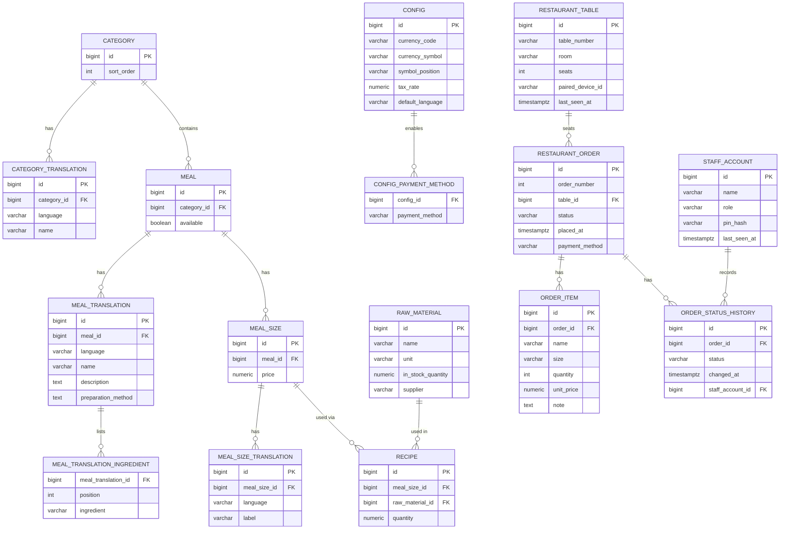

# Database schema

Reflects the schema created by Flyway migrations `V1`–`V11` (`backend/src/main/resources/db/migration/`). This covers the menu domain modeled in issue #3, the `Table`/`StaffAccount`/`Config` entities modeled in issue #4, and the `Order`/`OrderItem`/`OrderStatusHistory` entities modeled in issue #9 — the order *state machine* itself (legal transitions, order-number generation, price/tax calculation) is issues #10–#12, not yet reflected here.

## Notes

- **Translation tables** (`category_translation`, `meal_translation`, `meal_size_translation`) each carry a `language` column (`DE`/`EN`/`AR`) with a unique constraint on `(parent_id, language)`, per the project's i18n rule — content is stored per language rather than in nullable per-language columns, so a missing translation is a missing row, not a null.
- **`meal.available`** is a single flag (not per-size, not per-language).
- **`recipe`** links a `meal_size` (not `meal` directly) to a `raw_material`, per the proposal: *"Recipes link each meal size to its raw materials."*
- **`raw_material`** has no translation table — it's internal/back-of-house only, never shown to guests.
- **`meal_translation_ingredient`** is an `@ElementCollection` (an ordered list of plain strings per translation), not a shared/managed `Ingredient` entity like `raw_material` is.
- **`restaurant_table`**, not `table` — the `Table` entity name collides with the SQL reserved word `TABLE`, so it's explicitly mapped to a differently-named table.
- **`staff_account.role`** is enforced only via the Java enum (`EnumType.STRING`), no DB `CHECK` constraint — same precedent as `language`.
- **`config`** is a singleton table with no DB-level enforcement (e.g. no `CHECK (id = 1)`) — the `V9__config.sql` migration seeds exactly one row and callers are expected to fetch it by convention.
- **`config_payment_method`** is an `@ElementCollection` of an enum (`Set<PaymentMethod>`), keyed by `(config_id, payment_method)` — unordered, unlike `meal_translation_ingredient`'s ordered list.
- **`restaurant_order`**, not `order` — same reserved-SQL-keyword problem as `restaurant_table`.
- **`order_item`** has **no FK back to `meal`/`meal_size` at all** — `name`/`size`/`unit_price` are copied text/numbers at order time (see `OrderItem.snapshotFrom`), never referenced live, so a later menu edit can never rewrite a historical order.
- **`order_status_history`** is one row per status the order *reached* (not a from/to pair — the previous state is just the prior row, read back in chronological order via `@OrderBy("changedAt ASC")`). `staff_account_id` is nullable: a guest submitting their own draft has no staff member behind that transition.
- **`order_number`** is nullable — assigning it is issue #11's concurrency-safe generator, not modeled yet.
