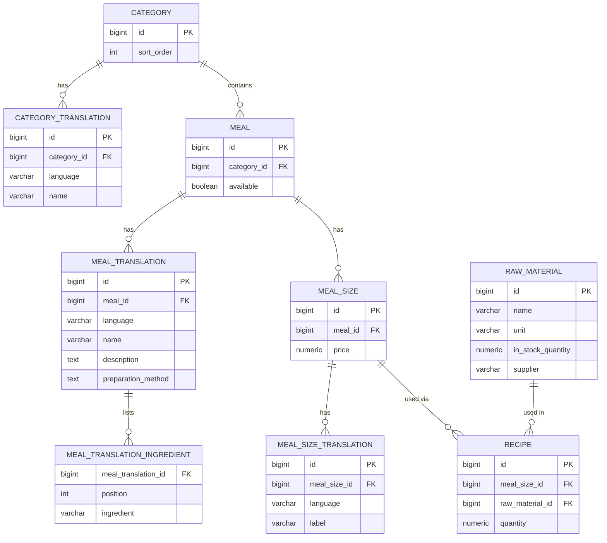

# Database schema

Reflects the schema created by Flyway migrations `V1`–`V6` (`backend/src/main/resources/db/migration/`). This covers the menu domain modeled in issue #3 — `Order`/`Table`/`StaffAccount`/`Config` will be added here as later tickets introduce them.

## Notes

- **Translation tables** (`category_translation`, `meal_translation`, `meal_size_translation`) each carry a `language` column (`DE`/`EN`/`AR`) with a unique constraint on `(parent_id, language)`, per the project's i18n rule — content is stored per language rather than in nullable per-language columns, so a missing translation is a missing row, not a null.
- **`meal.available`** is a single flag (not per-size, not per-language).
- **`recipe`** links a `meal_size` (not `meal` directly) to a `raw_material`, per the proposal: *"Recipes link each meal size to its raw materials."*
- **`raw_material`** has no translation table — it's internal/back-of-house only, never shown to guests.
- **`meal_translation_ingredient`** is an `@ElementCollection` (an ordered list of plain strings per translation), not a shared/managed `Ingredient` entity like `raw_material` is.
